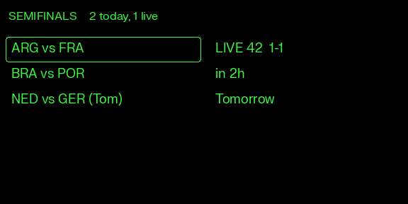
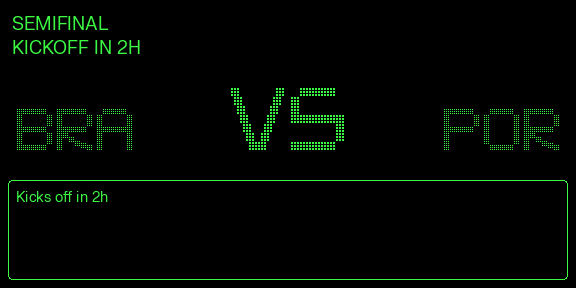
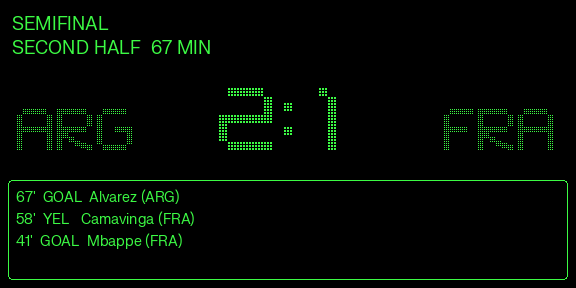
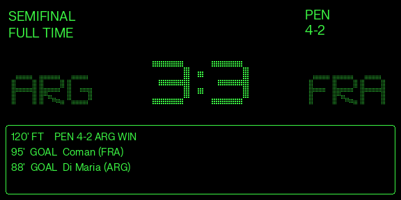

# World Cup — Even Hub App Spec

**App ID:** `com.even.worldcup`
**Display name:** World Cup
**Project root:** `~/CLAUDE_OUTPUT/apps/even-hub-worldcup`
**Architecture doc (Feishu):** `docx/EsiLducSSoIJsRx6kN8ccyIlnse`
**Status:** Demo / prototype. Mock data layer mirrors iSports response shape and timing. Swap to real backend = one-file change.

---

## 1. Goal

Glanceable World Cup matches on G2 + companion phone surface. Built as an Even Hub app (launched plugin), not a widget. Phone surface adds a per-match social voting feature that lives **only inside the per-match Detail view** (kept off the matches list to avoid clutter).

## 2. Scope

**In scope (v1 / demo)**
- 8-team knockout-only mock tournament. Stages: QF (4) → SF (2) → 3rd-place playoff (1) → Final (1) = 8 matches.
- **G2: two-layer IA.** Layer 1 = native LVGL list of all matches (Live → Upcoming → Past). Layer 2 = match detail.
- **Phone:** Matches tab (Live + Upcoming) and Bracket tab (visual hybrid: mini-tree SVG + stage-grouped cards). Per-match Detail with events timeline and a vote bar that is **only** visible from inside Detail.
- Light mode only on phone.
- Mock data that mirrors iSports response shapes (`Match.eventId`, status enum 0/1/2/3/4/5/-1/-10/-11/-12/-13/-14, etc.).
- Push-pattern state propagation (server "world" emits events; clients subscribe). Drop-in replacement: WS subscription to Even backend relay.

**Out of scope (v1)**
- Real iSports / Even backend wiring (mocked).
- Notifications, widget surface, OS overlay, goal sounds, haptics.
- Stats / H2H / Match Preview tabs from the widget reference Figma.
- Lineup tab on phone (deferred to v2).
- Localization beyond English.
- Authentication.

---

## 3. Mock Tournament

8 teams, hard-coded bracket. Demo "now" anchor:
- 4 QF matches: all FT (past). QF4 ESP vs POR finished 2-2 / POR 4-3 on pens — used to demo the penalty UI alongside SF1.
- **SF1 (ARG vs FRA): FT** — 3-3 at 120', ARG win 4-2 on penalties (the Lusail scoreline). Seeded as the persistent shootout-display match: the glasses Layer 2 default focus lands here on app load so the top-right PEN block is immediately visible without any navigation. Final.home is pre-resolved to ARG.
- SF2 (BRA vs POR): scheduled, kickoff in 2h
- 3rd-place (NED vs GER): scheduled, kickoff in 25h
- Final (ARG vs TBD): scheduled, kickoff in 49h — home pre-resolved from SF1; away resolves to "Winner SF2" once SF2 finishes
- Live demo is triggered on demand via the "Start live game" debug button, which resets SF1 to minute 1 / 0-0 / empty events / state='live' and starts the scripted tick.

### Live tick script (SF1)

Server-side timer advances 1 in-game minute per 4 real seconds (demo compression). Scripted events:

| Min | Event | New state |
|---|---|---|
| 45+2 | Half-time whistle | HT 1-1 |
| 46 | 2nd half starts | minute resumes |
| 58 | Yellow card FRA (Camavinga) | last event updates |
| 67 | Goal — Álvarez (ARG) | 2-1 |
| 79 | Yellow card ARG (Otamendi) | — |
| 90+4 | FT whistle | match moves to Past, Final.home resolves to "ARG" |

After FT, app falls back to "no live match" — Layer 2 falls through to next-upcoming. Reopening app re-seeds from minute 42 (demo loop).

---

## 4. Information Architecture

### 4.1 G2 glasses — two layers

| Layer | Role | Container shape |
|---|---|---|
| **Layer 1** (boot default) | **Today's schedule.** Header row (stage-as-hero, mirrors phone) + two leveled lists: left = matchup (interactive, owns selection border + `listItemEvent`), right = status (display-only). Filters to live + upcoming within 24h (WC days carry up to 6 matches). Past matches do NOT appear here — they live on phone's Bracket tab. | 1 text header + 2 list containers = 3 total. Only the left list has `isEventCapture=1` and `isItemSelectBorderEn=1`. |
| **Layer 2** | One-match detail. Works for any state (live / scheduled / ft). **No flags** — David rejected the mono-greyscale flag render as "cheap." Team codes widened (w=100) to fill the freed space. | 4 text + 1 image (= 5 total, exactly 1 `isEventCapture=1`). |

### R1 input contract

| Layer | Single tap | Double tap |
|---|---|---|
| **Layer 1** (list) | SDK fires `event.listEvent` (`List_ItemEvent`) with `eventType = CLICK_EVENT` + `currentSelectItemIndex`. Map index → match via `listMatchAtIndex(idx)` → enter Layer 2. | `event.listEvent.eventType = DOUBLE_CLICK_EVENT` (NOT `event.sysEvent` — the list container owns input). → `bridge.shutDownPageContainer(1)` system exit confirm dialog. |
| **Layer 2** (detail) | **No-op.** | `event.sysEvent.eventType = DOUBLE_CLICK_EVENT` → return to Layer 1 via `rebuildPageContainer`. |

> **SDK quirk (confirmed from `even_hub_sdk/dist/index.d.ts`):** A `ListContainerProperty` with `isEventCapture=1` consumes ALL input — single tap, double tap, scroll. The events arrive as `event.listEvent` of type `List_ItemEvent { containerID, currentSelectItemName, currentSelectItemIndex, eventType }`. The generic `event.sysEvent` channel is silent in this view. Earlier attempts at "tap → click" failed silently because we were listening on `(event as any).listItemEvent` (wrong key) and `event.sysEvent.eventType` (wrong channel). Wiring on `event.listEvent.eventType` is what makes both single-tap navigation and double-tap exit work.

### 4.2 Phone (Even app webview)

Top tab strip: `Matches | Bracket`.

- **Matches tab**
  - **Header (stage-as-hero):** title = current tournament stage, auto-derived as the EARLIEST non-FT stage in bracket order (Quarterfinals → Semifinals → 3rd-Place Playoff → Final); falls back to "Final" once everything is FT. Sub-line is live-state aware: `"{home} vs {away} live"` for a single live match, `"{n} matches live"` for multiple, `"Next kickoff in 2h"` for upcoming, `"Tournament complete"` once nothing's left. No fixed app name or product tagline.
  - **Live** section: red-bordered card for the one currently-live match.
  - **Upcoming** section: scheduled matches sorted by kickoff time.
  - **Results** section: completed matches (most recent first). Added so playoff history is visible on the main tab without switching to Bracket. Bracket remains the canonical tree view; Results is the chronological list of past outcomes.
  - **No vote chips on match rows.** Vote interaction is exclusively inside Detail.
- **Bracket tab** — hybrid (Option C):
  1. Compact non-interactive **mini-tree SVG** at the top showing QF → SF → F flow with right-angle connectors. Cells collapse to winner code on FT. Live cell red-bordered. TBD cells dashed + italic. (3rd-place omitted from the mini-tree — no tournament-tree relationship.)
  2. **Stage-grouped single-row cards** below: Quarterfinals · Semifinals · Final · 3rd-Place Playoff. Each card is a **single horizontal row** (`[flag] HOME  score  AWAY [flag]  badge`) — denser than the prior two-row home/away split. Winner code bolded, loser muted, TBD shown inline as `"TBD vs TBD"`. **No lineage labels** ("Winner QF1 vs Winner QF2" etc.) — David read them as patronizing; the bracket layout speaks for itself.
  - **Color coding**: FT cards get brand yellow `#FEF991` background (mini-tree cells too); Live keeps the red border; Upcoming + TBD share the default white surface (TBD only keeps a 0.7 row opacity for the placeholder).
- **MatchDetail** (push-stack from Matches or Bracket)
  - Header: flag + code + score + code + flag, status line, venue.
  - **Vote surface** (see §6.3) — visible here only.
  - Events timeline (newest first).

**Phone chrome (Flutter-in-webview):** pinned no-zoom viewport, no text selection on chrome, no tap highlight, no overscroll bounce, Cupertino-style confirm/alert dialogs, bottom slide-in toasts.

---

## 5. G2 Visual Design

| Layer 1 — today's schedule |
|---|
|  |

**SF1 ARG vs FRA progression — 3-beat narrative of the same Layer 2 surface:**

| Scheduled (kickoff in 2h, VS) | Live (post-Álvarez, 2-1 @ 67') | Full time (3-3, ARG win 4-2 pen) |
|---|---|---|
|  |  |  |

> Mockups above are PIL renders that mirror the runtime pipelines (`pixelAlphabet.ts` for codes + VS, `EvenTimeBigPixel` for digits, FK Grotesk Neue as a stand-in for the LVGL default font). The FT frame matches the `debugFinalWhistle()` scenario in §6.6 — Lusail-style 3-3 + shootout, ARG advance. Regenerate with `python3 scripts/render-g2-mockups.py` after any Layer 2 geometry change.


Reference patterns from Even OS public design guidelines (Navigate-Walking, Dashboard-News HUDs): **corner-anchored info chips, hero in center, negative space, multi-column data**.

### 5.1 Layer 1 container layout (576 × 288)

Header row (stage-as-hero) + two leveled list containers. Lists share y / height / itemCount so rows line up across the page.

```
+-------------------------------------------------------------+
|  SEMIFINALS    2 today, 1 live                              |  <- text header (default LVGL font)
|                                                             |
|  +---------------------+  +-----------------------------+   |
|  | ARG vs FRA          |  | LIVE 42  1-1                |   |  <- selected row (left list)
|  | BRA vs POR          |  | 2h                          |   |
|  +---------------------+  +-----------------------------+   |
+-------------------------------------------------------------+
```

**Containers — 3 total:**

| ID | Type | x,y,w,h | Content | EventCapture | SelectBorder |
|---|---|---|---|---|---|
| 10 | text | 8,8,560,28 | `"{STAGE}    {count} today[, N live]"` | 0 | — |
| 11 | list | 8,48,280,232 | one item per today match: `listLeft(m)` → `"ARG vs FRA"` | **1** | 1 |
| 12 | list | 296,48,272,232 | one item per today match: `listRight(m)` → status + score | 0 | 0 |

- **Today filter:** `listMatches()` = `[...store.getLive(), ...store.getUpcoming().filter(m => m.kickoffOffsetMin < 24*60)].slice(0, 6)`. WC days max out at 6 matches (group stage); knockout days are 1–4. Past matches do not appear — they're on phone Bracket only.
- **Header text** (`listHeaderText()`): title = same earliest-non-FT-stage logic as the phone header. Sub line = `"{N} today"` / `"{N} today, {L} live"` / `"No matches today"`.
- Left list owns input: SDK fires `event.listEvent` (typed `List_ItemEvent`) with `eventType` + `currentSelectItemIndex`. Map index → match via `listMatchAtIndex(idx)` → drill into Layer 2.
- Right list is display-only — items render to the right side of canvas naturally because its container starts at x=296.
- Row formatters in `src/g2/format.ts`:
  - LEFT — `listLeft(m)`: `"{home} vs {away}"` (`"TBD vs TBD"` if unresolved).
  - RIGHT — `listRight(m)`:
    - LIVE: `"LIVE 42  1-1"`
    - FT: `"FT  2-1"` (still formattable, but won't appear in today-filtered list)
    - Scheduled: `kickoffLabel(m)` → `"2h"` / `"1d"`

### 5.2 Layer 2 container layout (576 × 288)

Two-row header strip, then score + codes that all "sit on" the event log — all three bottom edges meet at `y=180` (= log top edge). Score is taller than codes so it pokes further up; everything ends at the same baseline.

```
+-------------------------------------------------------------+
|  SEMIFINAL                                                   |  header row 1: stage (56 tall, fits 2 rows)
|  SECOND HALF  42 MIN                                         |  header row 2: status
|                                                              |
|                +-------------------------+                   |
|                |          1 : 1          |                   |   score band, top y=68
|  +---------+   | EvenTimeBigPixel 80px   |   +---------+    |   codes top y=98, both
|  |  ARG    |   +-------------------------+   |  FRA    |    |   end at y=150 baseline
|  +---------+                                  +---------+    |
|       30 px lift gap between y=150 and y=180                 |
|  +--------------------------------------------------------+ |
|  | 67' GOAL Alvarez (ARG)                                 | |   event log, y=180
|  | 58' YEL Camavinga (FRA)                                | |
|  | 41' GOAL Mbappe  (FRA)                                 | |
|  +--------------------------------------------------------+ |
+-------------------------------------------------------------+
```

**Containers — 5 total (2 text + 3 image, exactly 1 isEventCapture), + 1 optional PEN block:**

| ID | Type | x,y,w,h | Content | EventCapture |
|---|---|---|---|---|
| 1 | text | 8,8,420,56 | `"{STAGE}\n{VERBOSE_STATUS}"` (plain LVGL font, 2 rows, left). Width shrunk from 560 → 420 to make room for the PEN block at the top right. | 0 |
| 2 | text | 436,8,132,44 | **PEN indicator** — included ONLY when `hasShootout(m)` is true. 2-row content `"PEN\n{home}-{away}"` (e.g. `PEN\n4-2`). Top-right anchor; gives the shootout score persistent visibility independent of the header status row. | 0 |
| 4 | image | 144,68,288,82 | Score image — EvenTimeBigPixel `"1 : 1"` (live/ft) or pixel-alphabet `VS` (scheduled); bottom at y=150 | 0 |
| 3 | image | 4,98,132,52 | Home code — pixel-alphabet, **align=right** (letters lean toward score) | 0 |
| 5 | image | 440,98,132,52 | Away code — pixel-alphabet, **align=left** (mirrors HOME about canvas axis x=287.5) | 0 |
| 7 | text | 8,180,560,100 | 3-row event log, full width, bordered. 30 px gap above (y=150 → y=180) lifts score + codes "off" the log instead of glueing them to it. | **1** |

> **Codes use a separate pixel-alphabet path, NOT EvenTimeBigPixel.** Earlier attempts (threshold=180/110/null) at rendering letters through EvenTimeBigPixel via canvas all came back blank — letter glyph strokes are too thin for browser canvas's text rasterizer to deposit enough luminance to survive 4-bit quantization. Reading `public/fonts/even-pixel-alphabet.svg` and stamping its lit cells directly to canvas (no font rendering step) bypasses the AA problem entirely. See §7.1 + `src/g2/pixelAlphabet.ts`.

> **Header is a plain text container** (NOT a canvas-rendered image). Earlier image-based header introduced font-load races AND tripped the sim's 288×144 max-image-size validator. Plain text container with default LVGL font is what David asked for ("just use the normal font").

> **No flags on G2.** The 16-shade greyscale flag render is technically correct and preserves value contrast (see §7.2), but reads as low-fidelity on the mono display vs the phone where the same SVGs render in full color. Flag pipeline (`renderFlagPng`, `getCachedFlag`, `preloadFlags`) is left in place for potential reinstatement later — currently only the phone consumes flag images.

### 5.3 Update strategy

| Trigger | API |
|---|---|
| App boot | `createStartUpPageContainer` (Layer 1) |
| `listItemEvent` in Layer 1 | `rebuildPageContainer(buildDetailPage(selectedMatchId))` → Layer 2 |
| Double-tap in Layer 2 | `rebuildPageContainer(buildListPage())` → Layer 1 |
| Live minute tick (Layer 2, match.state === 'live') | `textContainerUpgrade(header)` + `textContainerUpgrade(event_log)` |
| Goal event (Layer 2) | `updateImageRawData(score)` + `textContainerUpgrade(event_log)` |
| FT or store change (Layer 1) | `rebuildPageContainer(buildListPage())` so live match flips into past row in place |

`textContainerUpgrade` is flicker-free; `rebuildPageContainer` causes a brief flicker; `updateImageRawData` is in-place per container.

### 5.4 Brand on G2

- Monochrome green only. ER OS Green `#3CFA44` for lit pixels.
- No color flags (rendered as monochrome binary patterns). No team logos.
- Three-letter FIFA codes for team identity.
- ALL strings ASCII-sanitized via `asciiName()` — LVGL fallback renders unsupported glyphs (`é`, smart quotes, em-dashes, middle-dots) as vertical bars.

### 5.5 Simulator validation + SDK constraints (discovered through pain)

- **Image container max size: 288 × 144.** Anything larger fails `CreateStartUpPageContainer validation`. (Header 288×36 OK; score 288×120 OK; flags 72×40 OK.)
- **`ListContainerProperty` with `isEventCapture=1` consumes ALL input.** Events arrive on `event.listEvent` (typed `List_ItemEvent`) — NOT `event.sysEvent`. Read `event.listEvent.eventType` against `OsEventTypeList` and `event.listEvent.currentSelectItemIndex` to route by row.
- **List event payload key is `listEvent`, not `listItemEvent`.** Earlier `(event as any).listItemEvent` reads silently fail. The SDK envelope is `EvenHubEvent { listEvent?, textEvent?, sysEvent?, audioEvent?, jsonData? }`.
- **Multiple list containers on one page is fine.** Only ONE should have `isEventCapture=1`; the others render display-only and stay row-aligned by matching `itemCount` + `yPosition` + `height`.
- **HMR works against the running sim.** Vite's `page reload` events drive the sim's webview; killing the sim is rarely necessary. Only kill if the sim itself crashes or its app-data cache is poisoned.

---

## 6. Phone Visual Design

| Matches | Bracket | Detail (vote bar) | Goal toast |
|---|---|---|---|
|  |  |  |  |

> Phone screenshots are captured manually from the running phone surface (no headless browser in the toolchain — drop fresh ones into `docs/images/` after a UI change). The four reference shots above cover the canonical states: matches list with live + upcoming + results, bracket tab (mini-tree + stage cards), per-match detail with vote pill / bar, and the yellow goal toast in flight.

Even Design Library 3.0 tokens, light theme. No emojis anywhere.

### 6.1 Tokens

- Surfaces: `#FFFFFF` (page), `#F2F2F2` (card), `#E5E5E5` (nested)
- Text: `#222222` (primary), `#737373` (secondary), `#999999` (tertiary)
- Live signal: `#FF5454`
- Brand yellow: `#FEF991` — used on **goal toast** (`.toast.toast-goal`); FT bracket cards used to use this, now switched to `--neutral-200` gray (David: "too bright")
- Cards: white surface, elev-low shadow, 12px radius, 16px padding
- 8-pt spacing grid

### 6.2 Typography

- **FK Grotesk Neue** loaded locally via `@font-face` (Inter / system fallback).
- **Even Roster Grotesk** alt for Latin/Cyrillic/Greek.
- **Even Signature** available for special English moments.
- Negative letter-spacing throughout (signature Even tracking).
- Type scale follows Design Library 3.0.
- Hard rule: **pixel fonts are OS-only**, never on phone UI. See `reference_even_font_usage.md` in memory.

### 6.3 Per-match Support Vote (Detail-only)

Match-based (not team-based) — every match has its own poll. **Visible only inside the per-match Detail view**, not on the matches list rows.

**For live + scheduled matches** — initial state: two chip buttons:
```
[VOTE ARG]   [VOTE FRA]
```

**After user taps a side** — chips fade out (200ms) and collapse into a horizontal split bar (220ms fade-in, 320ms width transition):
```
████████████ 62% ARG │ FRA 38% ████████
```
- Single horizontal bar (28px tall); home left, 1px white divider, away right.
- User's pick: chosen side flips to `var(--er-black)` background with white text and a small dot marker.
- Single-vote-per-match-per-session (tapping again silently no-ops).
- Inline label / tooltip: "You voted ARG".

**For past (FT) matches** — frozen final bar; no chips ever shown; uses muted `var(--surface-1)` palette.

**Persistence (mock):**
- `localStorage['vote.{matchId}']` = `'home' | 'away'` (user's pick).
- `localStorage['tally.{matchId}']` = `"home:away"` raw counts including baseline.
- Baseline 100–500 votes per side, seeded deterministically from `matchId` via FNV-1a + xorshift32 so percentages are stable across renders/reloads.

**API shim (one place to swap):**
```ts
async function castVote(matchId: string, side: 'home'|'away'): Promise<VoteTally>
async function getTally(matchId: string): Promise<VoteTally>
```
v2 real backend: `POST /api/matches/{id}/vote` → `{ home, away, total }`. Subscribe via WS for live percentage updates.

### 6.4 Bracket tab — hybrid (Option C)

1. **Compact mini-tree SVG** (viewBox 200×130, scales to fit). QF → SF → F columns with right-angle polyline connectors. FT cells collapse to a single bold winner code; live cell has a red stroke + dot; TBD cells dashed + italic; **FT cells get brand-yellow fill** (`mt-done` class).
2. **Stage-grouped card list** below: Quarterfinals / Semifinals / Final / 3rd-Place Playoff. SF / F / 3rd-place cards carry a lineage hint ("Winner QF1 vs Winner QF2") so TBD slots read sensibly.
3. **Color rule** (single convention across mini-tree SVG cells + stage card list):

   | State | Mini-tree (`.mt-cell.*`) | Card (`.br-card-*`) |
   |---|---|---|
   | Live | `fill=surface-0`, `stroke=--live` (red) | red box-shadow (`--live`) |
   | FT (done) | `fill=--neutral-200`, soft gray | `background=--neutral-200`, soft gray |
   | Upcoming + TBD | default white surface (TBD = 0.7 opacity on rows) | default white surface (TBD = 0.7 opacity on rows) |

   Yellow used to mark `done` — David flagged "too bright"; neutral gray reads as "settled, retired into past" without competing with the live red.

### 6.6 Debug bar (demo only)

Pinned at the bottom of the phone surface (`.debug-bar` in `src/style.css`, handlers in `src/phone/debug.ts`):

| Button | Action |
|---|---|
| **Start live game** | Resets SF1 to a fresh kickoff — `state='live'`, `minute=1`, `0–0`, empty event log — then restarts the scripted live tick. Idempotent: hitting it again rewinds to minute 1. |
| **Mbappé scores** | Fires a goal event for FRA (away side of SF1) at the current minute via `store.applyEvent`. Same path the scripted tick uses, so the yellow goal toast pops automatically through the existing `detectGoals` subscriber. |

> Removed buttons: **"Penalty (ARG)"** (conflated awarded-vs-scored — every tap added 1 to home, which is wrong; if we ever need an in-game penalty awarded event it should be its own `pen` event type that does NOT carry a scoreDelta) and **"Final 3-3 (ARG 4-2 pen)"** (the shootout UI is demoed via seed data — see below — so no debug trigger is needed).

> **Shootout demo in seed data**: QF4 (ESP vs POR) is now seeded as a 2-2 regulation result resolved 4-3 to POR on penalties (`homePenalty=3, awayPenalty=4`). This makes the penalty rendering visible on initial app load — Results section on phone matches list, bracket card + mini-tree, and (when drilled into) the Layer 2 PEN indicator on glasses — without any debug interaction.

Strip the bar + handlers + `src/phone/debug.ts` when wiring real backend data. Added a public `store.touch()` so the start-live handler can mutate match fields directly (state, minute, score, events) and re-emit a UI notify without faking a synthetic event.

### 6.5 Chrome (Flutter-in-webview)

- Viewport: `width=device-width, initial-scale=1.0, maximum-scale=1.0, user-scalable=no`
- `body { touch-action: manipulation; overscroll-behavior: none; }`
- `* { -webkit-tap-highlight-color: transparent; -webkit-touch-callout: none; user-select: none; }`
- Cupertino confirm/alert dialogs (`src/phone/dialog.ts`)
- Bottom-center slide-in toasts (`src/phone/toast.ts`)

---

## 7. Asset & Font Pipeline

### 7.1 Score + team codes — two pipelines, one dot-matrix aesthetic

Layer 2 uses two different rasterizers that share the same look:

**Pipeline A — EvenTimeBigPixel + threshold (`src/g2/pngImage.ts:renderScorePng`)** for the score digits + colon.

1. Await `PIXEL_FONT_LOADED` (FontFace registration for `Even Time Big Pixel`).
2. Walk `sizes` (on-grid for `unitsPerEm=800`); pick the largest size whose rendered text fits in `w - 8`. Score uses `[80, 64, 50, 32, 25]`.
3. Render `text` centered, white-on-black, `imageSmoothingEnabled=false`, baseline=middle.
4. **Threshold post-process** (critical): browser canvas's text rasterizer always anti-aliases, which fills the dot-matrix font's intentional gaps with intermediate greys; the 4-bit quantizer then rounds those greys to "solid." Walk pixels, set lum ≥ 180 → 255, else 0. This restores the discrete on/off pattern the font was designed for. PIL renders this without AA — thresholding is how we mimic that path in the browser.
5. Encode 4-bit greyscale via `canvasTo16IndexedPng()`. All pixels are extreme (0 or 255), so they collapse to palette entries 0 / 15 cleanly.

**Pipeline B — Pixel-alphabet SVG atlas (`src/g2/pixelAlphabet.ts`)** for team codes + the `VS` placeholder.

Why a second pipeline: rendering LETTERS through Pipeline A consistently came back blank. Letter glyph strokes in EvenTimeBigPixel are thinner than its digit/colon glyphs; canvas's text rasterizer can't deposit enough luminance for them to clear threshold=180, and dropping the threshold lets AA fuzz win and the 4-bit quantizer collapses everything to "off." Tried thresholds 180, 110, null — all blank.

Workaround:

1. `public/fonts/even-pixel-alphabet.svg` is an A–Z atlas where each letter lives in `<g id="X">` with `<rect>` cells (`20×20` on a `30px` stride). Authored as ground-truth pixel art — no font rendering involved.
2. On first call, `pixelAlphabet.ts` fetches the SVG, parses each glyph into a normalized `{cols, rows, cells: [col, row][]}` grid, and caches in-process. Subsequent calls are synchronous (after the first fetch).
3. `renderPixelAlphabetPng(text, w, h)` auto-picks the largest stride (`dot+gap`) that fits the string in `w×h` from candidates `[4+1, 3+1, 2+1, 1+1, 1+0]`. For `140×80` codes the picked stride is typically `3` (dot=2, gap=1) — matches the SVG's own 20:10 cell:gap ratio.
4. The renderer stamps `ctx.fillRect(dot×dot)` for each lit cell. No canvas font rendering step → no AA → no luminance loss.
5. Encoded via `canvasTo16IndexedPng()` same as Pipeline A.

`preloadAlphabet()` is called fire-and-forget at boot so the first Layer 2 paint isn't blocked on the SVG fetch.

**Score uses `:` not `-`, with spaces.** EvenTimeBigPixel covers digits AND colon AND space natively (`0-9 A-Z a-z space colon`); it has no hyphen glyph. `scoreText(m)` returns `"{home} : {away}"` (padded both sides) — the font renders the separator with proper visual weight (twin clock-style dots) and the padding spaces give the colon visible breathing room.

**VS (scheduled / unresolved matches)** goes through Pipeline B for style consistency with the team codes. Earlier FK Grotesk Neue 900 fallback worked but broke the dot-matrix look. The VS render is PINNED to `{dot: 2, gap: 1}` (stride=3) so the letter height (21 rows × 3 − 1 = 62 px) matches the digit cap height when the score picker lands on fontPx=80 (620/800 × 80 ≈ 62 px). Without the pin, the picker would chase the largest stride that fits 288×120 — stride=5, letter height 104, ~1.7× the digit height — which David flagged as "outrageously big".

The 7-segment hand-drawn approach is gone. The LVGL-text-container fallback for codes is gone.

### 7.2 Flag image — 16-shade greyscale (inverted)

Pipeline (`src/g2/pngImage.ts:renderFlagPng()`):

1. Load colored SVG flag from `public/flags/{code}.svg`.
2. Render at 2× target size with smoothing.
3. Downsample to target size with high-quality smoothing.
4. **Inverted 16-shade greyscale** via `canvasTo16IndexedPng(canvas, { invert: true })`:
   - For each pixel, compute luminance (Rec.601: `0.299R + 0.587G + 0.114B`).
   - Encode as `idx = round((255 − lum) / 17)` → 0..15.
   - Multiply back by 17 to get a clean palette colour for UPNG to quantize.
5. Cache per-flag-per-size.

**Why inverted greyscale beats the prior binary threshold:** On a mono-green display, "lit" pixel = bright green. White flag fields should read as OFF, dark colored shapes should LIGHT UP. Binary threshold collapsed everything to lit/off — France's red/white/blue became three solid blocks, Argentina's pale-blue/white became a near-blank. With 16-shade inverted greyscale, dark navy reads brighter than pale blue, which reads brighter than white — the flag's value structure survives onto the mono display.

**Currently consumed by phone surface only.** Flags were removed from G2 Layer 2 (David: "looks cheap"). `preloadFlags` / `getCachedFlag` exports remain for potential reinstatement, but no G2 boot path calls them.

`canvasToBinaryPng()` was removed; `assembleScorePng()` was removed (font-based score path dead).

### 7.6 Flag assets — full 58-team WC 2026 coverage

`public/flags/{fifa-lowercase}.svg` covers all 58 WC 2026 teams in our `TeamCode` union. The original mock was authored against 48 publicly-projected qualifiers; per David's #1A decision after the iSports adapter landed, we expanded by 10 nations to cover iSports' actual projected bracket (BIH, CPV, CUW, COD, JOR, SCO, RSA, SWE, TUR, UZB). With this expansion the iSports `/schedule?leagueId=1572` adapter now hydrates 72 of the 104 published matches (the remaining 32 are R32 placeholders like `"73 WIN"` / `"[A3]/[B3]/…"` that can't resolve until the group stage runs).

Source: [`flag-icons`](https://github.com/lipis/flag-icons) (Apache-2.0). Copied via `scripts/copy-flags.sh`, which maps FIFA-3 codes (e.g. `ARG`, `KSA`, `CIV`) to the package's ISO-2 filenames (`ar`, `sa`, `ci`). England + Scotland are special cases — they use `gb-eng.svg` (St George's Cross) and `gb-sct.svg` (Saltire) since they're sub-national identities in the underlying ISO.

Coverage breakdown (matches `TeamCode` union in `src/types.ts` and the registry in `src/mock/teams.ts`):

| Confederation | Count | Codes |
|---|---|---|
| CONCACAF (incl. 3 hosts) | 6 | USA CAN MEX CRC PAN JAM |
| CONMEBOL | 6 | ARG BRA URU COL ECU PAR |
| UEFA | 20 | ESP FRA ENG GER ITA NED POR BEL CRO SWI DEN POL AUT CZE SRB NOR **BIH SCO SWE TUR** |
| CAF | 12 | MAR SEN EGY GHA CMR NGA ALG TUN CIV **CPV COD RSA** |
| AFC | 10 | JPN KOR AUS IRN KSA QAT UAE IRQ **JOR UZB** |
| OFC + playoffs | 4 | NZL BOL HAI **CUW** |
| **Total** | **58** | bold = added per #1A after iSports adapter landed |

To refresh assets (after a flag-icons version bump, or to swap a placeholder once a real qualifier is confirmed): edit the `PAIRS` array in `scripts/copy-flags.sh`, then `bash scripts/copy-flags.sh`.

### 7.3 Header — plain text, default LVGL font

The Layer 2 header is a **`TextContainerProperty`** with default LVGL font, NOT a canvas-rendered image. Removed `renderHeaderTextPng()` entirely. Reasons:

- LVGL has no `text-align: center`, but for the top strip we don't need it — left-aligned at x=8 reads fine.
- Avoids FontFace race that caused initial-paint flicker / fallback rendering.
- Avoids the sim's 288×144 max-image-size validation rejection.

### 7.4 EvenTimeBigPixel font reference (CONFIRMED via fontTools inspection)

- **Family name:** `Even Time Big Pixel`
- **PostScript name:** `EvenTimeBigPixel`
- **unitsPerEm:** **800** (non-standard). Clean grid sizes: **8, 10, 16, 20, 25, 32.**
- **Char coverage (65 chars):** `0–9 A–Z a–z space colon`. **No hyphen/minus, no period, no other punctuation.** Score dash MUST be hand-drawn `fillRect`.
- typoAscender 620, typoDescender 0, lineGap 340.
- File: `public/fonts/EvenTimeBigPixel.ttf`.
- **OS-only rule:** the font FILE belongs to OS UI. Using it inside our app to RASTERIZE a bitmap that we ship to a G2 image container is permitted — the OS never sees the font file, only the resulting pixels.

### 7.5 Other fonts in project

- `public/fonts/FKGroteskNeue.ttf` — phone primary
- `public/fonts/EvenRosterGrotesk.otf` — phone alt Latin/Cyrillic/Greek
- `public/fonts/EvenSignature.otf` — special English moments
- `public/fonts/even-pixel-alphabet.svg` — A–Z pixel-art atlas (G2 codes + VS). Authored by David; lives in `public/fonts/` so Vite copies it into `dist/` for the `.ehpk` package. Schema: one `<g id="X">` per uppercase letter, each containing `<rect width="20" height="20" x=… y=…>` cells on a `30px` grid stride.

**Asset bundling — what ships inside the `.ehpk`:**
Everything under `public/` is copied verbatim to `dist/` at build time. The `.ehpk` packager zips `dist/`, so the plugin is fully self-contained: fonts, flags, the pixel alphabet, and the JS bundle all travel together. No runtime dependency on the host app's asset catalog.

---

## 8. Data Transport Architecture

### 8.1 Provider: iSports REST (no native WebSocket)

iSports doesn't offer WS. Polling every endpoint from every client is wasteful. Recommended production architecture:

```
Phones + glasses
     ↑
  WS / SSE / FCM push
     ↑
  Even backend relay
     ↑
  REST poll every 5s
     ↑
  iSports cloud
```

Benefits: single iSports consumer (one rate budget, one bill); clients receive push; server dedupes / throttles / prioritizes (goals immediately, minute updates every 15s); static data cached at edge.

If WS is a hard requirement and managed: **Sportmonks** offers WS + webhooks natively (5–30× iSports cost).

### 8.2 iSports endpoints

| Endpoint | Path | Update window | Recommended poll | Hard cap |
|---|---|---|---|---|
| Livescores (full snapshot) | `/sport/football/livescores` | now | 1 / min | 10 / sec |
| Livescores Changes (incremental) | `/sport/football/livescores/changes` | last 20 s | **2–10 s** | 1 / sec |
| Events | `/sport/football/events?cmd=new` | last 3 min | 1 / min | 10 / sec |
| Lineups | `/sport/football/lineups` | past 24 h; ±3 days w/ isPreview | 60–90 s | 1 / 60 s |
| Schedule | `/sport/football/schedule` | by date / leagueId | 12 h | 60 / sec |
| Team profile | `/sport/football/team` | static | 1 / day | 1 / 1800 s |
| Player profile | `/sport/football/player` | static | 1 / day | 60 / sec |

**Product 219 = FIFA World Cup 2026** bundle, $49/mo, leagueId 1572.

**Event reconciliation:** events have stable `eventId`. Only added/removed (never modified) — corrections delete-then-insert. Client must dedupe by `eventId`.

**Match status enum** (iSports values):
`0 = not_started · 1 = first_half · 2 = half_time · 3 = second_half · 4 = extra_time · 5 = penalty · -1 = finished · -10 = cancelled · -11 = TBD · -12 = terminated · -13 = interrupted · -14 = postponed`

### 8.3 Backend robustness — can the Mac Mini host this?

**Demo + small audience (<500 users): yes.**
**Public launch with thousands of concurrent viewers: no — but a $5–10/mo cloud VPS is the answer, not a beefier home server.**

Load profile per match:
- iSports calls: 5s poll × 90 min = ~1,100 inbound calls per match. Comfortable.
- WS fan-out: 1 publication × N subscribers; ~200 bytes per push. CPU light.
- Static caching: team/player profiles cached 24h.

Mac Mini M2 ceiling (residential network):
- WebSocket connections: easily 5k–10k concurrent; tuned, 50k+.
- Bandwidth: residential ~50–500 Mbps up. 1k users × few KB/s ≈ 40–80 Mbps sustained — at the upper limit of typical residential.
- iSports outbound: a few KB × 12 polls/min = ~1 MB/min. Trivial.

Real failure modes:
1. **Residential ISP reliability** — ~99.5% uptime ≈ 3.6h downtime/month. Untenable during a Final.
2. **Dynamic IP / NAT** — fix with Tailscale (already on `claw`) or Cloudflare Tunnel.
3. **Power outage / macOS auto-reboot** — disable auto-reboot, configure launchd auto-restart.
4. **Bandwidth burst on goal moments** — 10k × 200 bytes = 2 MB instant burst. Fine on cable.
5. **Single point of failure** — no redundancy.

**Recommendations:**

- **Phase 0 (demo, <500 users):** Mac Mini fine. Cloudflare Tunnel for stable public endpoint, launchd for auto-restart.
- **Phase 1 (alpha, 500–5k users):** Mac Mini = iSports poller + Redis source-of-truth. Push a thin WS edge to $6/mo DigitalOcean droplet / Fly.io free tier. Edge owns long-lived WS connections; Mini stays local.
- **Phase 2 (public, 5k+):** Full relay on managed VPS, 2–3 region replicas (~$15–30/mo). Mac Mini becomes backup poller.

**Architecture detail at Phase 1+:**
```
iSports →(REST)→ Mac Mini Poller →(Redis pub/sub)→ Cloud WS Edge →(WS)→ Clients
```

---

## 9. Mock Strategy

Mock simulates **push-pattern semantics**, not direct client polling. Matches the production relay shape so demo code maps 1:1 to real architecture.

- In-browser hidden "server world" (`src/state/mockServer.ts`) advances on private timer (1 in-game minute per 4 real seconds).
- Scripted live events fire on SF1 (see §3).
- Client (`src/state/store.ts`) subscribes; UI updates reactively.
- Events carry `eventId` for stable reconciliation.

**Production swap:** replace `mockServer` tick with WS subscription to Even backend relay. Client rendering code unchanged.

---

## 10. File Map

```
even-hub-worldcup/
├── spec.md                        # this file
├── app.json                       # Even Hub manifest (com.even.worldcup, sdk 0.0.10)
├── package.json
├── tsconfig.json
├── vite.config.ts
├── index.html                     # no-zoom viewport, local fonts only
├── src/
│   ├── types.ts                   # Domain types + IsportsStatus enum mirror
│   ├── upng-js.d.ts               # UPNG type shim
│   ├── style.css                  # Even DL 3.0 tokens + chrome rules + vote + bracket
│   ├── main.ts                    # Bridge setup, R1 wiring, two-layer view state machine
│   ├── mock/
│   │   ├── teams.ts               # 8 teams + flag asset paths
│   │   └── tournament.ts          # 8 matches + scripted SF1 live tick
│   ├── state/
│   │   ├── store.ts               # shared store with subscribe + getLive/getUpcoming/getPast/getAll/get
│   │   └── mockServer.ts          # server-world tick driver (was liveClock.ts)
│   ├── g2/
│   │   ├── format.ts              # listLeft, listRight, statusVerbose, scoreText, asciiName, eventChip, pastRow
│   │   ├── pixelAlphabet.ts       # SVG A–Z atlas loader + renderPixelAlphabetPng (codes + VS)
│   │   ├── pngImage.ts            # canvas → 4-bit PNG, renderScorePng (EvenTimeBigPixel + threshold), renderVsPng, renderCodePng, renderFlagPng (16-shade), preloadFlags
│   │   └── pageView.ts            # buildListPage (Layer 1), buildDetailPage (Layer 2),
│   │                              # pickFocusMatch, getMatchById, listMatchAtIndex, DETAIL_IDS
│   └── phone/
│       ├── mount.ts               # Matches + Bracket + Detail; vote rendered ONLY in Detail; debug bar wired
│       ├── bracketSvg.ts          # hybrid mini-tree SVG + stage-grouped cards (color-coded)
│       ├── toast.ts               # bottom slide-in toast (default + goal variant)
│       ├── dialog.ts              # Cupertino confirm + alert
│       ├── debug.ts               # demo-only: start-live-game + Mbappé-scores handlers
│       └── support.ts             # per-match castVote / getTally / getUserVote / getTallySync
├── scripts/
│   ├── copy-flags.sh              # one-shot: copies 48 WC2026 flags from flag-icons → public/flags/
│   └── render-g2-mockups.py       # PIL renderer for the spec's G2 screenshots (Layer 1 + Layer 2 vs/live/ft)
├── docs/
│   └── images/                    # Spec screenshots: g2-layer-1.png, g2-layer-2-{vs,live,ft}.png (PIL),
│                                  # phone-{matches,bracket,detail,toast-goal}.png (manual capture)
├── public/
│   ├── flags/                     # 48 WC 2026 country SVG flags (see §7.6)
│   └── fonts/
│       ├── FKGroteskNeue.ttf      # phone primary
│       ├── EvenRosterGrotesk.otf  # phone alt
│       ├── EvenSignature.otf      # special English
│       ├── EvenTimeBigPixel.ttf   # canvas-only for G2 score digits + colon
│       └── even-pixel-alphabet.svg # A–Z pixel atlas for G2 codes + VS (see §7.5)
```

Files removed during this iteration: `src/state/nav.ts` (legacy), `src/g2/pngImage.ts:renderHeaderTextPng` (replaced by plain text container).

---

## 11. Current build status

| Layer | Status |
|---|---|
| Mock tournament + scripted tick | Done |
| iSports-shaped types (status enum, eventId) | Done |
| Phone Matches view (Live + Upcoming, DL 3.0 styling) | Done |
| Phone Detail view (events timeline + vote surface) | Done |
| Phone Bracket — hybrid mini-tree + stage cards | Done |
| **Phone bracket color coding (FT=yellow / Live=red / Upcoming+TBD=neutral)** | **Done** |
| Phone toast + Cupertino dialogs | Done |
| Phone no-zoom Flutter chrome | Done |
| **Phone per-match vote — Detail-only (chips → percentage bar)** | **Done** |
| **G2 Layer 1 — native LVGL list, half-width, item-select border** | **Done** |
| **G2 Layer 2 — match detail (flags + tight codes + pixel score + 2-row event log)** | **Done** |
| **G2 gestures — list `listItemEvent` drills in; double-tap exits / returns** | **Done** |
| **G2 list includes Live + Upcoming + Past (not just past)** | **Done** |
| **G2 plain text header (default LVGL font)** | **Done** |
| **Score image — EvenTimeBigPixel at on-grid 80px + hand-drawn dash + threshold (preserves dot-matrix gaps)** | **Done** |
| **Flag image — 16-shade inverted greyscale (phone-only; removed from G2 Layer 2)** | **Done** |
| **G2 Layer 1 = today's schedule + stage-as-hero header (mirrors phone)** | **Done** |
| **G2 Layer 2 = no flags; codes + VS use dedicated pixel-alphabet SVG atlas pipeline (`pixelAlphabet.ts`); score uses EvenTimeBigPixel + threshold** | **Done** |
| **Score uses ":" with spaces via EvenTimeBigPixel; VS uses pixel-alphabet (style-consistent with codes)** | **Done** |
| **Layer 2 reflow v2: codes lifted to short row (132×52) that sits ON the event log (bottom-of-code = top-of-log, no gap); event log now full-width 560×100 (was 288×108, "tiny bit shorter")** | **Done** |
| **Layer 2 reflow v3: score (288×120) also sits on event log — its bottom edge meets y=180 like the codes; all three end at the same baseline. Header split into 2 rows (stage \\n status); header height bumped 20→44.** | **Done** |
| **Bottom-aligned rendering INSIDE the image canvas: pixel-alphabet `offY = h - renderH` (was centered); score uses `textBaseline='alphabetic'` at `y=h` (was 'middle' at `h/2`). Container's bottom edge = visible glyph bottom = text-box top edge, no dead pixels below.** | **Done** |
| **Header `\\n` bug fix: stage + status now asciiName-sanitized SEPARATELY before joining. Earlier `asciiName('A\\nB')` stripped the \\n (outside \\x20-\\x7E printable-ASCII range), collapsing both rows into one line. Event log already does it right (map asciiName then join).** | **Done** |
| **Goal toast switched to Even-yellow variant** (`toast.toast-goal` — yellow bg + dark text, dedicated CSS class; `toast()` now takes `{variant: 'goal'}` opts). Default black/inverse toast preserved for non-goal events (vote confirm, etc.). | Done |
| **Bracket FT color rule unified**: `mt-done` SVG fill + `br-card-done` background both switched from `--er-accent-yellow` to `--neutral-200`. Single coloring convention across mini-tree images + stage cards. | Done |
| **Layer 2 reflow v4**: header bumped 44→56 (2-row content was clipping). Score band reshaped to 288×82 @ (144, 68); code row to 132×52 @ (·, 98). All three end at y=150 (was y=180); text box stays at y=180 — opens a 30 px gap that "lifts" the score + codes off the log. | Done |
| **Phone topbar coverage fix**: topbar now extends background into wrap's 16 px horizontal padding via `margin: 0 calc(-1 * var(--s-4))` + matching internal padding. Top padding adds `env(safe-area-inset-top)` for notched phones. Brand + tabs stay aligned to the 16 px content gutters. | Done |
| **Spec screenshots**: `scripts/render-g2-mockups.py` emits 4 PIL-rendered G2 PNGs (Layer 1 schedule, Layer 2 vs/live/ft) into `docs/images/` and is wired into §5. Phone surface PNGs are manual-capture placeholders in §6. | Done |
| **Debug bar on phone surface**: bottom-fixed pill bar with "Start live game" + "Mbappé scores" buttons. Handlers in `src/phone/debug.ts`; reset path uses new `store.touch()` to re-emit notify without faking events. Strip when wiring real backend. | Done |
| **Penalty shootout in data model**: `Match.homePenalty / awayPenalty` (nullable). `store.winnerOf` consults them on regulation ties so the Final auto-resolves. `format.ts` adds `hasShootout()` / `penaltyText()`; `listRight` (Layer 1 right column) appends `(4-3p)` for FT-shootout. Phone bracket card score line gets a `(3-4 pen)` suffix on `.br-pen` typography; `stageBadge` shows `FT · PEN`. Matches list rows + match detail view show the same suffix + `FT · PEN` label. | Done |
| **G2 Layer 2 top-right PEN indicator**: dedicated 2-row text container at (436, 8, 132, 44) showing `PEN\n{h}-{a}`. Header width shrunk 560→420 to make room. Container is added to the page payload ONLY when `hasShootout(m)`; `statusVerbose` no longer carries PEN suffix (penalty has a single home in the UI, top-right). | Done |
| **Penalty UI demoed via seed mock**: QF4 ESP vs POR seeded as a 2-2 / POR-wins-4-3-pen result so the penalty rendering is visible across the bracket + matches Results section + Layer 2 (when drilled in) without needing any debug action. | Done |
| **PIL mockup updated**: FT frame in `docs/images/g2-layer-2-ft.png` now shows the new layout — header back to clean `FULL TIME`, top-right `PEN / 4-2` block, score 3:3, log highlights PEN 4-2 ARG WIN. | Done |
| **Team-code mirror alignment**: `renderPixelAlphabetPng` gained `align: 'left'|'center'|'right'` option; `renderCodePng(code, w, h, side)` passes `'right'` for HOME and `'left'` for AWAY so letters lean toward the score and end up true mirror-symmetric about the canvas axis. Earlier floor-centered placement was off by 1–2 px because `(CODE_W − renderW)` is odd. Every dot still lands on an integer pixel. | Done |
| **Penalty display persistence**: SF1 reseeded as the FT 3-3 / ARG-4-2-pen result so the PEN block is visible by default on Layer 2 without needing to drill into QF4. `pickFocusMatch` now prefers a recent shootout over upcoming matches when no live game is going (live > recent-shootout > upcoming > past). Final.home pre-resolved to ARG since the seed bypasses `applyEvent`'s auto-resolve path. | Done |
| **Score font candidate set bumped back up to [80, 64, 50, 40, 32] — 80px lands cleanly on unitsPerEm=800 grid (10 canvas px per design cell)** | **Done** |
| **Phone → Glasses navigation sync (tap match on phone → glasses Layer 2; phone back → glasses Layer 1)** | **Done** |
| **Phone Matches tab: Results section added (past matches visible without switching to Bracket)** | **Done** |
| **Bracket cards: single-row layout per match (was two-row home/away split)** | **Done** |
| Lineage labels ("Winner QF1 vs Winner QF2") removed from bracket | Done |
| Kickoff-reminder button + confirm dialog removed from MatchDetail | Done |
| Team codes: now image-rendered via new pixel-alphabet SVG atlas (David supplied `even-pixel-alphabet.svg`); LVGL-text fallback removed | Done |
| List capped at top 6 matches | Done |
| List `event.listEvent` wiring (CLICK + DOUBLE_CLICK both via list channel) | Done |
| **58 WC 2026 flag assets shipped + complete `TEAMS` registry** (48-team mock baseline + 10 iSports projection additions per #1A) | **Done** |
| **iSports Phase 3 — adapter + pollers + tests + live smoke** (`server/isports/` module, `ENABLE_ISPORTS=true npm run server` gate, 72/104 schedule matches hydrating, decode patched to authoritative docs id=15 mappings) | **Done** |
| **Stage-as-hero phone header** (auto-derived from bracket state; no fixed app name, no product tagline) | **Done** |
| Font loading (local @font-face, FK + EvenTimeBigPixel) | Done |
| `state/liveClock.ts` → `state/mockServer.ts` rename | Done |
| `state/nav.ts` removal | Done |
| Real iSports relay wiring | Deferred to v2 |
| Lineup tab on phone | Deferred to v2 |

---

## 12. Outstanding work

### P0 — none currently. All open feedback addressed in this iteration.

### P1 — polish backlog
- Verify the mini-tree's brand-yellow FT fill at small viewport (mobile) doesn't clash with stroke color.
- Consider scroll affordance hint on G2 Layer 1 if list grows beyond visible area (8 matches at default item height should fit cleanly in 272px tall, but worth checking).
- Layer 2 swipe up/down to cycle to prev/next match (currently no swipe — back-out then re-enter).

### P2 — clean-up
- Audit LVGL artifacts (stray vertical bars from glyph fallback) on real hardware — mitigations in place (`asciiName`, fixed container heights), but worth a careful pass.

### P3 — backend wiring
- Stand up Mac Mini-based iSports poller per §8.3 Phase 0 architecture.
- Cloudflare Tunnel for stable public endpoint.
- Implement `/api/matches/{id}/vote` + WS channel per match.
- Swap `src/state/mockServer.ts` for WS subscription. Client rendering unchanged.

### Pn — deferred
- Lineup tab on phone (mock starting XI).
- Goal celebration animation on phone (optional polish).
- Stats / H2H / Match Preview tabs.

---

## 13. Process notes & references

- **Architecture doc** mirrored to Feishu `docx/EsiLducSSoIJsRx6kN8ccyIlnse` (322 blocks, 1 native mermaid).
- **G2 design references** from public design guidelines Figma `X82y5uJvqMH95jgOfmV34j`: Navigate-Walking (`8523:22973`), Dashboard-News (`8554:18930`), Dashboard-News-List (`8534:1968`), Teleprompt (`8399:54259`). PNGs cached in `/tmp/even-os-refs/`.
- **WC widget design reference** (text-based two-half pattern) in Figma `8iXKFSKUc2V7MzaF3VvCEA` node `13251:751553`. Cached at `/tmp/even-os-refs/wc-widget-ref.png`.
- **iSports docs:** https://www.isportsapi.com/en/products/detail/football-api-product-219.html
- **Even font wiki:** Feishu `TQmewzuY6iamnNkImHtcsP5rndf` — pixel font OS-only rule + EN↔CN pairings.

Memory pointers (persist across `/compact`):
- `project_worldcup_evenhub.md` — this project's index
- `reference_even_font_usage.md` — font rules
- `even_brand_colors.md`, `even_brand_typography.md`, `even_design_system.md` — Even DL 3.0
- `reference_g2_display_geometry.md` — 576×288 canvas, bi-display offsets

**David's hard rules to follow:**
- ZERO emojis in any output (code, docs, chat, tool descriptions).
- ASCII-only on G2 text containers (LVGL drops accents / smart quotes / em-dashes / middle-dots as fallback rectangles).
- Light mode only on phone.
- Pixel fonts (EvenTimeBigPixel, 20px/22px pixel grotesks) are OS-only as font files. Using them inside our app to rasterize bitmaps for G2 image containers is OK.
- Never overwrite a user-edited file without re-reading it first.
- Image containers on G2 cap at 288×144 (sim-enforced).
- `ListContainerProperty` with `isEventCapture=1` emits `listItemEvent`, not `CLICK_EVENT` — handle accordingly.
